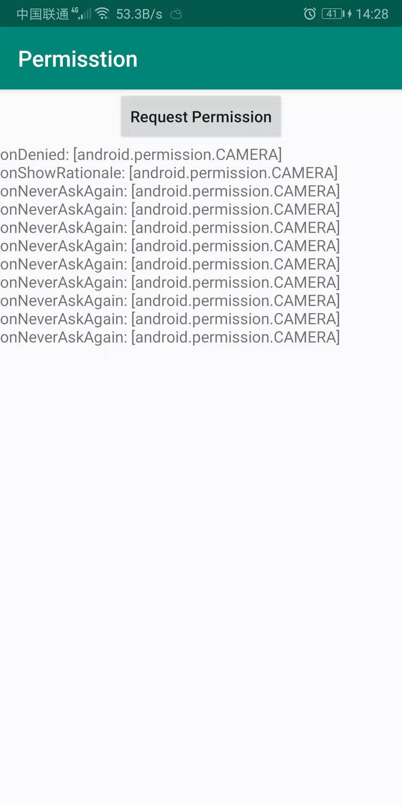

# Permission
## 集成
#### 1. 添加maven:
    allprojects {
	    repositories {
	        maven { url 'https://www.jitpack.io' }
	    }
	}
#### 2. module添加引用
	dependencies {
        implementation 'com.github.taijuan.Permission:PermissionKt:1.1.0'
	}
## 截图

